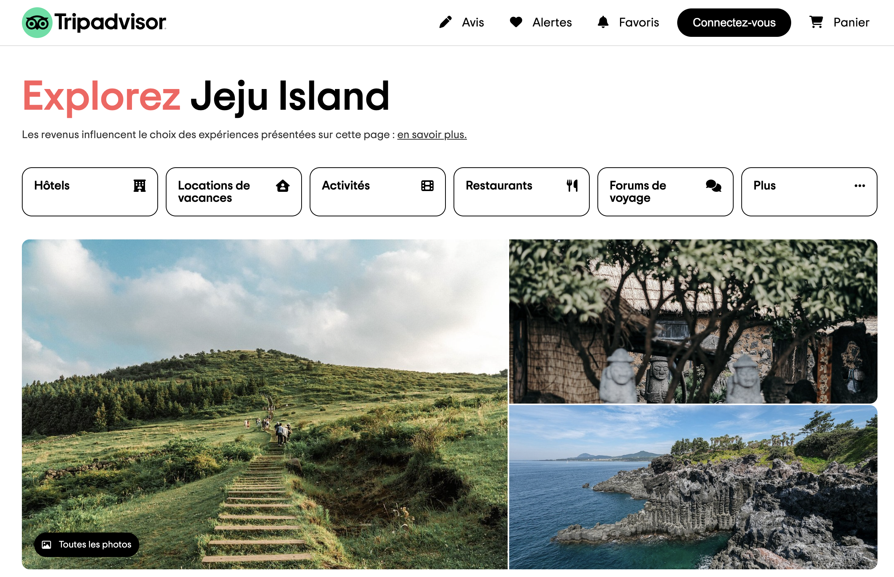

# TripAdvisor - Frontend Clone 🌏

As part of my training at [Le Reacteur](https://www.lereacteur.io/) to become a full-stack developer, we were to recreate a clone of [TripAdvisor](https://www.tripadvisor.fr/)'old website.

_This website is just an exercice and will not be deployed or use, beside as a portfolio._

## Overview 🚀

Check the live demo [here](https://potaaeeto.github.io/TripAdvisor-HTMLCSS/) and test it! 😊
It is fully responsive for all devices, built using HTML, CSS and a little bit of JavaScript.



## Tasks 🫠

✓ Complete integration, responsive frontend (CSS only : flexbox and carousel)

✓ Creation of a modal form by clicking on "Contactez-nous" button

✓ Use responsive design

## Stacks 📚

- HTML5
- CSS3
- Media queries (responsive design)
- JavaScript

## Prerequisites 🤔

Before you begin, ensure you have met the following requirements:

✓ [Git](https://git-scm.com/downloads) must be installed on your operating system.

## Installing TripAdvisor's clone 🗝️

To install the website, follow these steps:

```bash
git clone https://github.com/Potaaeeto/TripAdvisor-HTMLCSS.git
```
